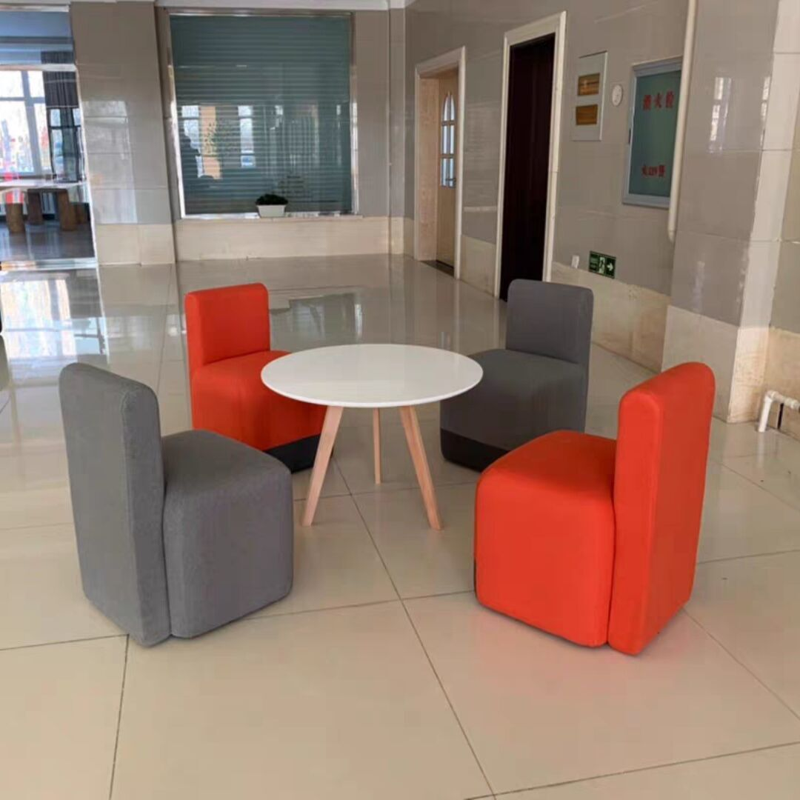
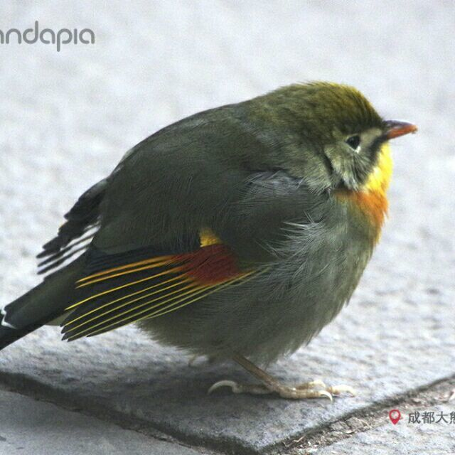

# 鱼叉助手(内部测试..尚未开放)

+ **鱼叉脚本** 使用 **Lua** 语言进行编写,支持 **Lua** 的所有语法与基本函数，配合 **鱼叉脚本** 特有的函数命令，实现找图、找色、触摸等高级功能。
+ 编写脚本前请先学习 **Lua** [基本语法教程](https://www.bilibili.com/video/BV1rt411f7GY) | **Lua** [脚本入门教程](https://www.bilibili.com/video/BV1SW411C7u3)

# 下载安装

鱼叉助手 VScode [插件下载](https://gitee.com/lua_development/yxzhushou/blob/master/vscode插件安装包) | [安装方法](https://gitee.com/lua_development/yxzhushou/blob/master/vscode插件安装包/安装方法.png)

# 文档

引擎版本：1.0.0

鱼叉助手API [码云文档](https://gitee.com/lua_development/yxzhushou/blob/master/鱼叉助手API文档.md) 

# 参与贡献

我们非常期待您的贡献，无论是完善文档，提出、修复 Bug 或是增加新特性。
如果您在使用过程中发现文档不够完善，欢迎记录下来并提交。
如果发现 bug，请通过 [码云issues](https://gitee.com/lua_development/yxzhushou/issues) 留言来提交并描述相关的问题，您也可以在这里查看其它开发人员的 issues，通过解决这些 issues 来贡献代码。

鱼叉助手 [码云仓库](https://gitee.com/lua_development/yxzhushou) 鼓励开发者的参与和贡献，期待你的加入。

免责声明与责任限制：
“软件”及其中的“贡献”在提供时不带任何明示或默示的担保。在任何情况下，“贡献者”或版权所有者不对任何人因使用“软件”或其中的“贡献”而引发的任何直接或间接损失承担责任，不论因何种原因导致或者基于何种法律理论，即使其曾被建议有此种损失的可能性。 

# 技术支持

如有问题可以先参阅 [码云文档](https://gitee.com/lua_development/yxzhushou/blob/master/鱼叉助手API文档.md)， 或使用 [码云issues](https://gitee.com/lua_development/yxzhushou/issues) 留言，我们会关注和回复。

- 鱼叉助手开发交流 [QQ群](https://qm.qq.com/cgi-bin/qm/qr?k=rQob0dn2oFrLPLuqmXKuUi76oFa-HWkM&jump_from=webapi)：715467974
- 项目组合作联系 [QQ客服](http://sighttp.qq.com/authd?IDKEY=b57a92f4779302b4283e6497ba8b723e769fac125c5e55c4)：2787283623

# 项目组

## Lua 教学项目组

讲师入驻条件：
* 掌握 Lua 语言
* 熟悉 鱼叉助手 开发流程
* 熟悉 剪辑 软件

简介：

哔哩哔哩(B站) | Youtube(油管) | 网易云课堂 | 抖音 | [付费课程](https://gitee.com/lua_development/yxzhushou/blob/master/付费课程目录.md) | [免费课程](https://space.bilibili.com/72510501)

[//]: contributor-faces

[//]: contributor-faces

## iOS App项目组

App 开发入驻条件：
* 掌握 Objective-C 、Lua 、 C/C++ 语言开发
* 掌握 Objective-C 与 Lua 交互开发 
* 掌握 Objective-C 与 C/C++ 交互开发
* 拥有 iOS 开发者账号

简介：

底层架构师 | 开发工程师 | 管理员 | [App 更新日志](https://gitee.com/lua_development/yxzhushou/blob/master/更新日志/iOS更新日志.md)

[//]: contributor-faces

[//]: contributor-faces

iOS 免越狱物联网 | Lua 内测小组

[//]: contributor-faces

...

[//]: contributor-faces

## Android App项目组

App 开发入驻条件：
* 掌握 Java 、 Lua 、 C/C++ 语言开发
* 掌握 Java 与 Lua 交互开发 
* 掌握 Java 与 C/C++ 交互开发

简介：

底层架构师 | 开发工程师 | 管理员 | [Java 开发教程](https://docs.qq.com/mind/DVmRQZFFISUV2dXZp)
 | [App 更新日志](https://gitee.com/lua_development/yxzhushou/blob/master/更新日志/Android更新日志.md)

[//]: contributor-faces

[//]: contributor-faces

Android Root/免Root | Lua 内测小组

[//]: contributor-faces

...

[//]: contributor-faces

## linux服务器 web项目组
底层架构师 | 开发工程师 | 管理员 | [更新日志](https://gitee.com/lua_development/yxzhushou/blob/master/更新日志/Linux更新日志.md)

[//]: contributor-faces

[//]: contributor-faces

## VScode 插件项目组

入驻条件：
* 掌握 TypeScript 、JavaScript 、C/C++ 语言开发
* 掌握 node 环境开发
* 掌握 VScode [中文文档](https://github.com/zifanzilog/VS-Code-Extension-Doc-ZH) 以及 VScode 功能 
* 熟悉访问 GitHub 社区 技术

简介：

底层架构师 | 开发工程师 | 管理员 | [更新日志](https://gitee.com/lua_development/yxzhushou/blob/master/更新日志/VScode插件更新日志.md)

[//]: contributor-faces

[//]: contributor-faces

## ESP8266/ESP32 物联网项目组

入驻条件：
* 掌握 Lua 语言开发
* 掌握 单片机 开发流程
* 熟悉 ESP8266/ESP32 物联网芯片 [NodeMCU Lua文档](https://nodemcu.readthedocs.io/en/release/)
* 熟悉 电路 基础知识

简介：

底层架构师 | 开发工程师 | 管理员 | [更新日志](https://gitee.com/lua_development/yxzhushou/blob/master/更新日志/ESP8266更新日志.md)

[//]: contributor-faces

[//]: contributor-faces

## 图像识别 算法项目组

入驻条件：
* 掌握 Lua 、C/C++ 、Java 语言开发
* 对 数学 有兴趣
* 熟悉 图片 与 像素 的运用

简介：

底层架构师 | 开发工程师 | 管理员 | [更新日志](https://gitee.com/lua_development/yxzhushou/blob/master/更新日志/图像识别更新日志.md)

[//]: contributor-faces

[//]: contributor-faces

# 特别感谢
GitHub 社区开源作者

[//]: contributor-faces

[//]: contributor-faces
